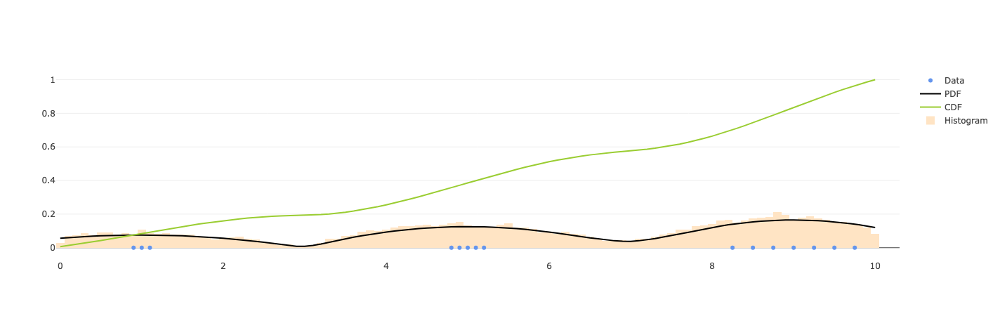
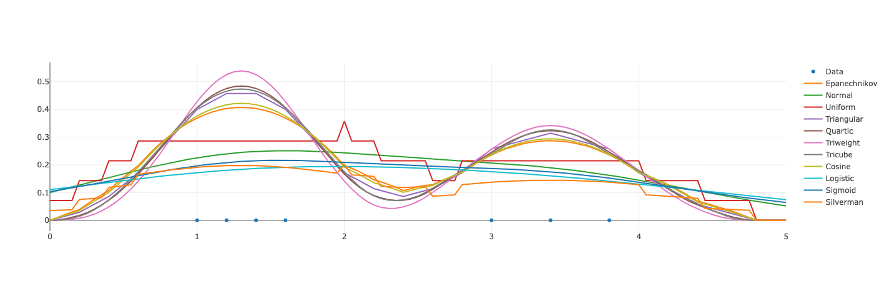

# kernel-density-estimation


Kernel density estimation in Rust.

Kernel density estimation (KDE) is a non-parametric method to estimate the probability
density function of a random variable by taking the summation of kernel functions centered
on each data point. This crate serves three major purposes based on this idea:
1) Evaluate the probability density function of a random variable.
2) Evaluate the cumulative distribution function of a random variable.
3) Sample data points from the probability density function.

An excellent technical description of the method is available
[here](https://bookdown.org/egarpor/NP-UC3M/kde-i.html).

__Note:__ Currently only univariate distributions are supported but multivariate is a goal in the future!

## Examples

__[univariate](examples/univariate.rs)__ - This example showcases the core `pdf`, `cdf`, and `sample` functionalities for a univariate distribution.
```
cargo run --example univariate
```


__[kernel](examples/kernel.rs)__ - This example showcases each of the available kernel functions.
```
cargo run --example kernel
```


## Roadmap

Refer to the [milestone issues](https://github.com/seatonullberg/kernel-density-estimation/issues) to see the direction the project is headed in future releases or [CHANGELOG.md](./CHANGELOG.md) to see the changes between each release.

## License

Distributed under the MIT License. See [LICENSE](./LICENSE) for more information.

## Acknowledgements

* Notes for Nonparametric Statistics[^citation] - An excellent technical description of nonparametric methods referenced heavily in the development of this project.

[^citation]: García-Portugués, E. (2022). Notes for Nonparametric Statistics.
Version 6.5.9. ISBN 978-84-09-29537-1.
